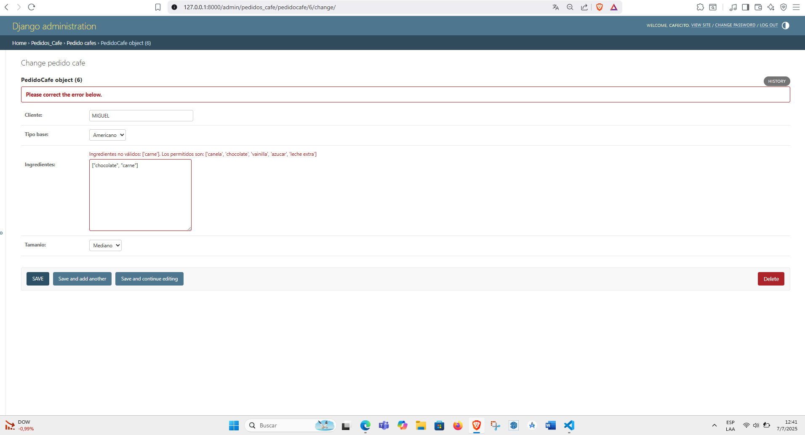
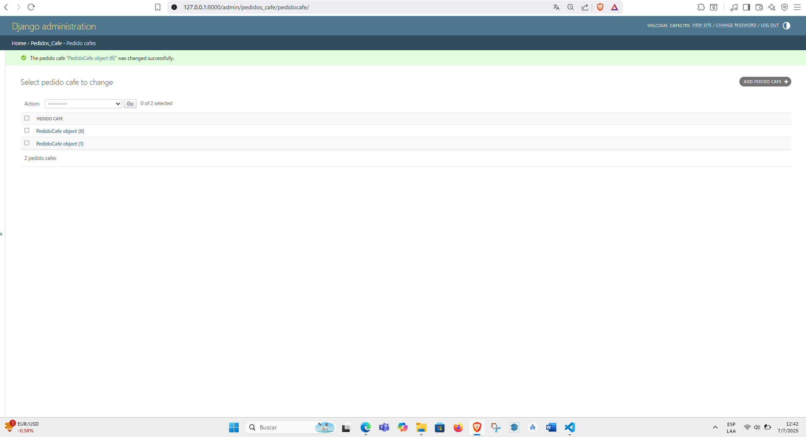
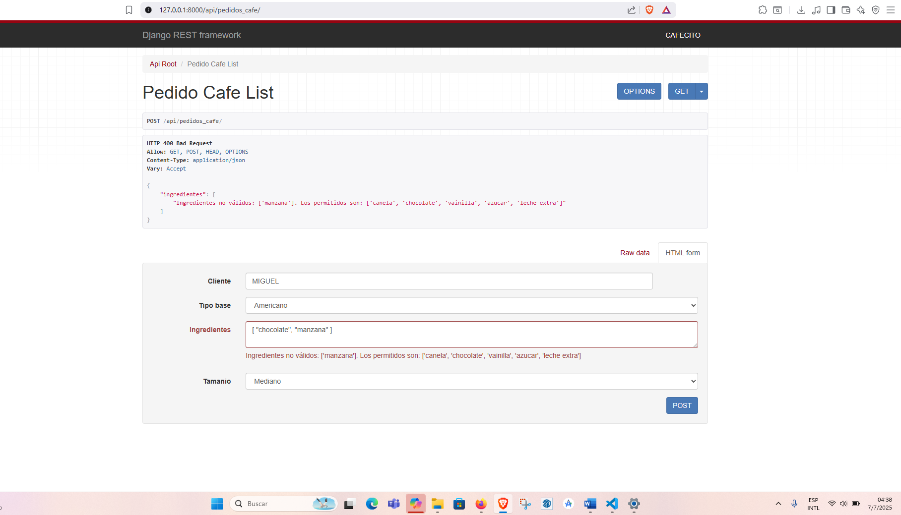
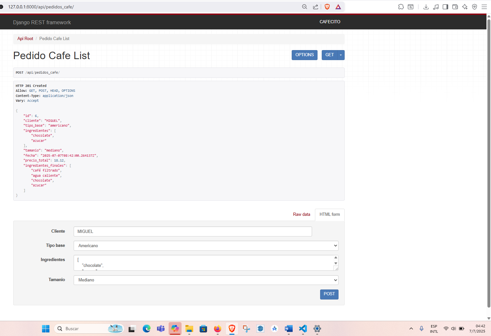

# PG2_PRACTICA5
# ☕ API de Pedidos de Café

Este proyecto implementa una API REST para gestionar pedidos de café usando Django y Django REST Framework, aplicando patrones de diseño: **Factory**, **Builder**, **Director** y **Singleton**.

## 📋 Tabla de Contenidos
1. [Configuración del Entorno](#-1-configuración-del-entorno)
2. [Creación del Proyecto](#-2-creación-del-proyecto)
3. [Estructura del Modelo](#-3-estructura-del-modelo)
4. [Implementación de Patrones](#-4-implementación-de-patrones)
5. [API y Vistas](#-5-api-y-vistas)
6. [Validaciones](#-6-validaciones)
7. [Despliegue](#-7-despliegue)

## 🛠 1. Configuración del Entorno

### Creación y activación del entorno virtual
```bash
python -m venv env
# Windows
.\env\Scripts\activate
# Linux/Mac
source env/bin/activate
```
### Instalación de dependencias
```bash
# requirements.txt
Django==5.2
django-extensions==4.1
djangorestframework==3.16.0
pydotplus

pip install -r requirements.txt
```
## 🚀 2. Creación del Proyecto
```bash
django-admin startproject api_patrones .
python manage.py startapp pedidos_cafe
```
### Configuración inicial
```python
# settings.py
INSTALLED_APPS = [
    ...
    'django_extensions',
    'rest_framework',
    'pedidos_cafe',
]
```
## 🏗 3. Estructura del Modelo
### Modelo principal
```python
# pedidos_cafe/models.py
class PedidoCafe(models.Model):
    cliente = models.CharField(max_length=100)
    tipo_base = models.CharField(max_length=20, choices=[...])
    ingredientes = models.JSONField(default=list)
    tamanio = models.CharField(max_length=10, choices=[...])
    fecha = models.DateTimeField(auto_now_add=True)
```
### Clases base de café
```python
# pedidos_cafe/base.py
class Espresso(CafeBase):
    def inicializar(self):
        self.ingredientes = ["café concentrado"]
        self.precio = 10
```
## 🧩 4. Implementación de Patrones
### Factory Pattern
```python
# pedidos_cafe/factory.py
class CafeFactory:
    @staticmethod
    def obtener_base(tipo):
        if tipo == "espresso":
            return Espresso()
```
### Builder Pattern
```python
# pedidos_cafe/builder.py
class CafePersonalizadoBuilder:
    def agregar_ingrediente(self, ingrediente):
        precios = {
            "canela": 1,
            "chocolate": 2,
            "vainilla": 1.5,
            "azucar": 0.5,
            "leche extra": 2,
        }
        if ingrediente not in precios:
            raise ValueError(f"Ingrediente '{ingrediente}' no válido")
```

## 🌐 5. API y Vistas
### Serializador
```python
# pedidos_cafe/serializers.py
class PedidoCafeSerializer(serializers.ModelSerializer):
    precio_total = serializers.SerializerMethodField()
    ingredientes_finales = serializers.SerializerMethodField()
```
### URLs
```python
# urls.py
urlpatterns = [
    path("admin/", admin.site.urls),
    path("api/", include(router.urls)),
]
```
## ✔️ 6. Validaciones
### Validación de ingredientes
```python
def clean(self):
    INGREDIENTES_PERMITIDOS = ['canela', 'chocolate',...]
    ingredientes_invalidos = [i for i in self.ingredientes...]
```
## 🚀 7. Despliegue
```bash
python manage.py makemigrations
python manage.py migrate
python manage.py createsuperuser
python manage.py runserver
```

### Accesos:

Panel de administración: http://localhost:8000/admin/



API REST: http://localhost:8000/api/pedidos_cafe/


